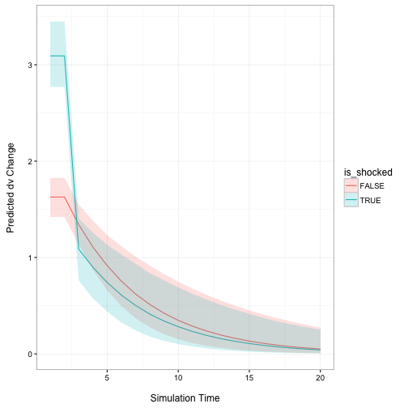

ecmSim
==============

[](https://travis-ci.org/christophergandrud/ecmSim)

Early stage development version of a *possible* R package for simulating
quantities of interest from Error Correction Models (ECM). This includes
interactions [!INCOMPLETE!].

Use the `ecm_builder` function to simulated the quantities of interest and the
`ecm_plot` function (NOT COMPLETED to plot the results.

# Example

Imagine we have a two time series `dv` and `iv`. We want to estimate the
relationship between these two series using an error correction model.

Our estimation model could look like this (assuming we have already created
the change and lag variables and they are each in their own vectors or equal
length):


```r
# Estimate error correction model
m1 <- lm(d_dv ~ lag_dv + lag_iv + d_iv)
```

We then create a data frame of fitted values for the baseline scenario to
simulate.


```r
baseline_scen <- data.frame(lag_dv = mean(lag_dv, na.rm = TRUE),
                            lag_iv = mean(lag_iv, na.rm = TRUE))
```

We also specify the "shock" to `iv`, the effects of which we want to compare to
the baseline.


```r
iv_shock <- sd(d_iv, na.rm = TRUE)
```

We now have all of the information we need to simulate the effects estimated in
the ECM over 20 periods:


```r
m1_sims <- ecm_builder(obj = m1, lag_iv = 'lag_iv', d_iv = 'd_iv',
                       iv_shock = sd(d_iv, na.rm = TRUE),
                       baseline_df = baseline_scen, t_extent = 20)
```

```
## lag_dv not supplied. Assuming first column of baseline_df is the lagged dependent variable:
## 
##       lag_dv
```

```r
# Show a sample of the simmulation output
head(m1_sims)
```

```
##   time__   qi_min qi_median   qi_max is_shocked
## 1      1 3.354857  3.460830 3.581232      FALSE
## 2      2 4.183715  4.376470 4.602829      FALSE
## 3      3 4.807383  5.096392 5.448344      FALSE
## 4      4 5.270811  5.668590 6.161334      FALSE
## 5      5 5.616830  6.115853 6.747906      FALSE
## 6      6 5.889580  6.464041 7.282271      FALSE
```

The simulated quantity of interest is the value of `dv` at each time point
(i.e. lagged `dv` + the change in `dv` from the previous period).

We can plot the results (note, in the future there will be a `ecm_plot` function
to simplify this process):


```r
ggplot(m1_sims, aes(time__, qi_median, group = is_shocked,
                    colour == is_shocked, fill = is_shocked)) +
    geom_line(aes(color = is_shocked)) +
    geom_ribbon(aes(ymin = qi_min, ymax = qi_max), alpha = 0.2) +
    scale_y_continuous(limits = c(0, 25)) +
    xlab('\nSimulation Time') + ylab('Predicted dv\n') +
    theme_bw()
```




# To-do

- [ ] Create `ecm_plot` function.

- [ ] Interaction example.

# See Also

- See [Warner (2016)](http://static1.squarespace.com/static/5555d102e4b01c8e639df2ca/t/57dcad86d482e9d2d5628489/1474080150275/Warner-Conditional-Relationships.pdf)
for details.

- King, Gary, Michael Tomz, and Jason Wittenberg. 2000. "Making the Most of
Statistical Analyses: Improving Interpretation and Presentation." American
Journal of Political Science 44(2): 341-55.
